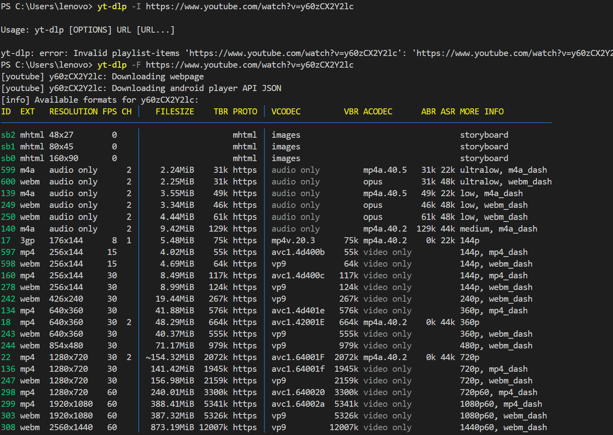
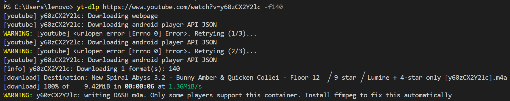

## 从YouTube下载视频

-   工具准备

    -   $yt-dlp$​ 

        ```
        https://github.com/yt-dlp/yt-dlp
        ```

    -   格式工厂

    -   $YouTube$​视频封面获取 

        ```
        https://www.strerr.com/
        ```

    -   $VPN$​​ 

        ```
        https://t.me/s/cylink_announcement
        ```

-   流程

    1.  获取$YouTube$上的视频对应$URL$链接
    2.  根据链接在终端使用$yt-dlp$下载对应视频到本地
    3.  当出现下载的视频与其对应的音频分离的情况时：分别下载视频与其音频，使用格式工厂进行混流合并
    4.  使用$YouTube$视频封面获取网站获取视频封面
    5.  上传至b站（严肃说明转载问题、简介参考furu_BriefIntroduction.txt）

-   $KEY-POINT$

    -   $yt-dlp$的使用

        -   查看$URL$对应的信息选项参数 $-F$

            举例：

            ```
            yt-dlp -F https://www.youtube.com/watch?v=y60zCX2Y2lc
            ```

            

        -   根据所查到的信息界面的$id$，利用选项参数 $-f$ 可进行对应项目下载

            举例1：

            ```
            yt-dlp https://www.youtube.com/watch?v=y60zCX2Y2lc -f140
            ```

            

            举例2：可用 $+$ 进行多个多个项目的同时下载

            ```
            yt-dlp https://www.youtube.com/watch?v=y60zCX2Y2lc -fsb2+308
            ```

        -   如果已经安装过$ffmpeg$，可以使用选项参数$--merge-output-format$，转成$mp4$格式可直接写上其参数

            举例：

            ```
            yt-dlp --merge-output-format mp4 https://www.youtube.com/watch?v=y60zCX2Y2lc -f140+308
            ```

        -   一些小事情：要有$Python 3$环境，会用终端，安装$yt-dlp$的命令：

            ```
            pip3 install yt-dlp
            ```

            其他的就去看前面给的官方文档吧，这些比较常用列出来